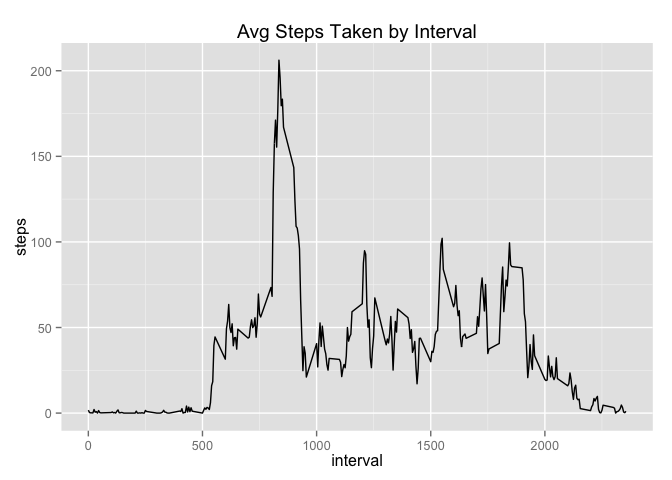
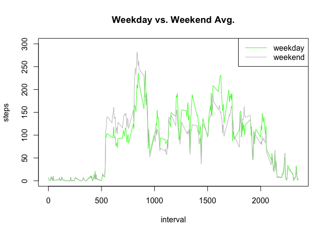

# Reproducible Research: Peer Assessment 1


## Loading and preprocessing the data


```r
setwd("~/JHDataScience/Reproducable_Research/RepData_PeerAssessment1")
unzip(zipfile="activity.zip")
activity_df <- read.csv("activity.csv")

library(ggplot2)
library(sqldf)
```

```
## Loading required package: gsubfn
## Loading required package: proto
## Loading required package: RSQLite
## Loading required package: DBI
```

## What is mean total number of steps taken per day?

```r
stepsByDay <- tapply(activity_df$steps, activity_df$date, sum, na.rm=T)
stepsByDayMean <- mean(stepsByDay)
stepsByDayMedian <- median(stepsByDay)
stepsByDayMean
```

```
## [1] 9354.23
```

```r
stepsByDayMedian
```

```
## [1] 10395
```

```r
qplot(stepsByDay, binwidth=1000, xlab='Total Steps per Day')
```

 

## What is the average daily activity pattern?

```r
stepsByInterval <- sqldf("select interval, avg(steps) as avg_steps from activity_df group by interval")
```

```
## Loading required package: tcltk
```

```r
qplot(stepsByInterval$interval, stepsByInterval$avg_steps, data = stepsByInterval, geom="line",xlab ="interval", ylab = "steps", main = "Avg Steps Taken by Interval")
```

 

```r
stepsByIntervalMax <- sqldf("select interval, avg(steps) as avg_steps from activity_df group by interval order by avg_steps desc limit 1")
stepsByIntervalMax
```

```
##   interval avg_steps
## 1      835  206.1698
```

## Imputing missing values

```r
activity_df_na <- sqldf("select count(*) as count_na from activity_df where steps is null")

# missing values
stepsByIntervalWithMax <- sqldf("select interval, max(steps) as avg_steps from activity_df group by interval")

# function to get max steps by interval to 
populateMissingValues <- function(df){
    for(i in 1:nrow(df)){
        if(!is.null(df[i,1]) && is.na(df[i,1])){
            selected_interval <- df[i,3]
            selected_interval
            
            avg_steps <- stepsByIntervalWithMax[which(stepsByIntervalWithMax$interval == selected_interval),] 
            
            avg_steps <- avg_steps[1,2]
            avg_steps
            df[i,1] <- avg_steps
        }   
    }
    return (df)
}

activity_df_replace_na <- populateMissingValues(activity_df)
stepsByIntervalReplaceNa <- sqldf("select interval, avg(steps) as avg_steps from activity_df_replace_na group by interval")
qplot(stepsByIntervalReplaceNa$interval, stepsByIntervalReplaceNa$avg_steps, data = stepsByIntervalReplaceNa, geom="line", xlab ="interval", ylab = "steps", main = "Avg Steps Taken by Interval (replace NA)")
```

 

```r
stepsByDayRemoveNa <- tapply(activity_df_replace_na$steps, activity_df_replace_na$date, sum)
stepsByDayRemoveNaMean <- mean(stepsByDayRemoveNa)
stepsByDayRemoveNaMedian <- median(stepsByDayRemoveNa)
stepsByDayMean
```

```
## [1] 9354.23
```

```r
stepsByDayMedian
```

```
## [1] 10395
```

## Are there differences in activity patterns between weekdays and weekends?

```r
stepsByIntervalDate <- sqldf("select date, interval, avg(steps) as avg_steps from activity_df_replace_na group by date,interval")
# weekends
weekendSteps <- subset(stepsByIntervalDate, weekdays(as.Date(stepsByIntervalDate$date)) == "Saturday" | weekdays(as.Date(stepsByIntervalDate$date)) == "Sunday" )
stepsByIntervalWeekend <- sqldf("select interval, avg(avg_steps) as steps from weekendSteps group by interval")

# weekdays
weekendSteps <- subset(stepsByIntervalDate, weekdays(as.Date(stepsByIntervalDate$date)) != "Saturday" | weekdays(as.Date(stepsByIntervalDate$date)) != "Sunday" )
stepsByIntervalWeekday <- sqldf("select interval, avg(avg_steps) as steps from weekendSteps group by interval")

par(mfrow=c(1,1))  
with(stepsByIntervalDate, plot(avg_steps ~ interval, type="n", main="Weekday vs. Weekend Avg.", ylab = "steps", ylim=c(0,300)))  
with(stepsByIntervalWeekend, lines(steps ~ interval, type="l", col="green"))  
with(stepsByIntervalWeekday, lines(steps ~ interval, type="l", col="16" ))  
legend("topright", lty=c(1,1), col = c("green", "16"), legend = c("weekday", "weekend"), seg.len=3)
```

 
